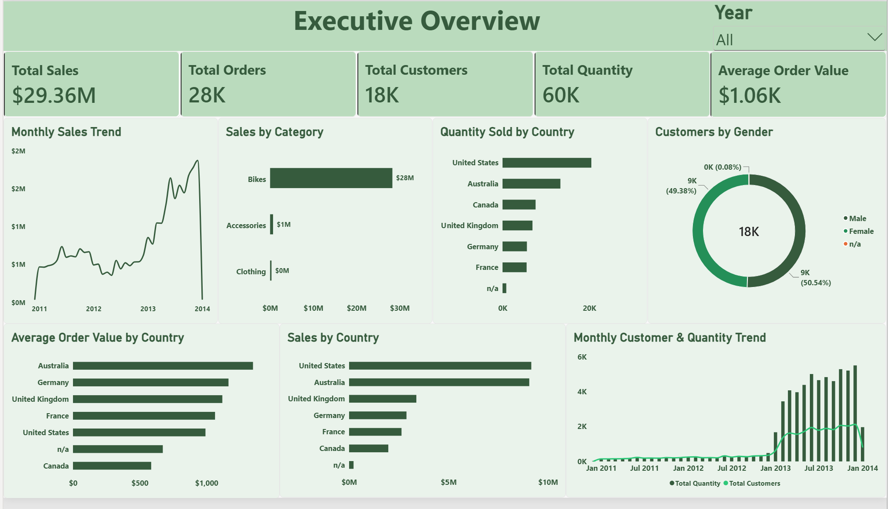
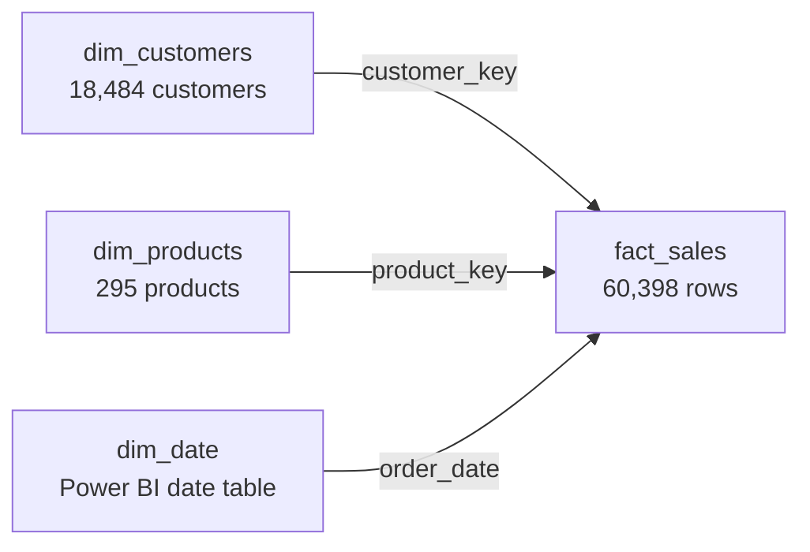
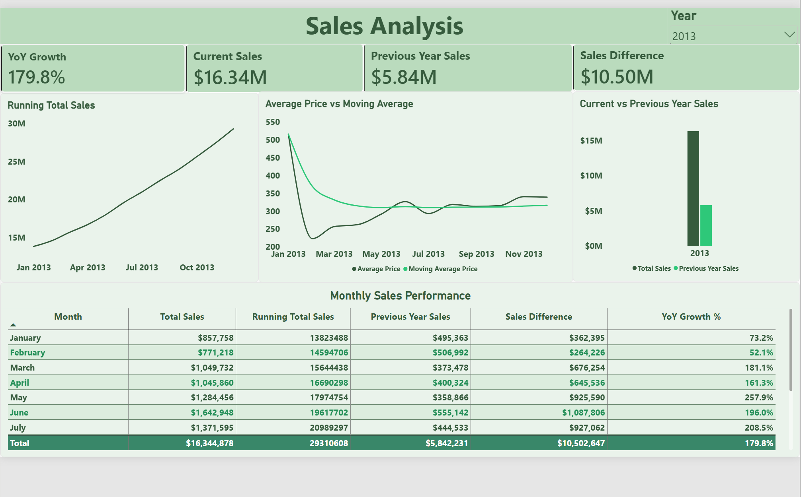
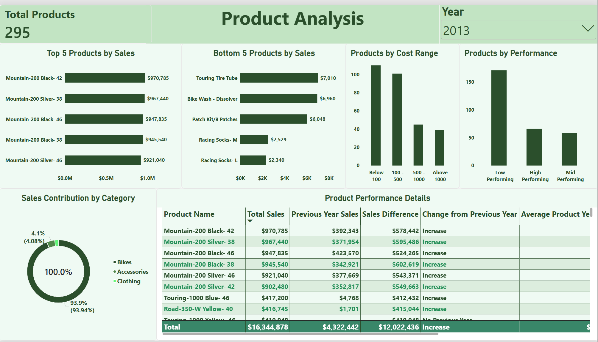
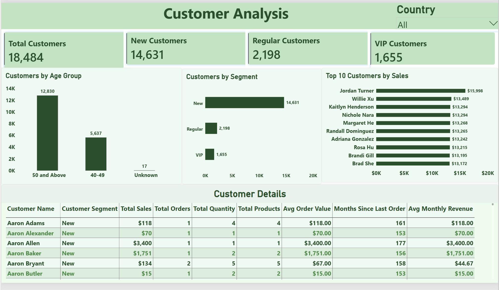

# Retail Business Intelligence

End-to-end retail sales analytics project using **SQL Server** and **Power BI** to transform a multi-year star-schema dataset into reproducible analysis, customer/product segmentation, time-intelligence metrics, and an interactive business dashboard.

> **Live Interactive Dashboard:** Power BI Service link will be added after publication.

## Dashboard Preview



The Power BI report contains four pages: **Executive Overview, Sales Analysis, Product Analysis, and Customer Analysis**.

## Project Overview

This project follows a connected analytics workflow rather than treating SQL and Power BI as separate exercises:

1. Explore and validate the raw dimensional model in SQL Server.
2. Calculate core business measures and rankings.
3. Extend the analysis using window functions, cumulative metrics, year-over-year comparisons, part-to-whole analysis, and segmentation.
4. Recreate and extend the analytical logic in Power BI using DAX and an explicit date table.
5. Present the results through interactive Year and Country slicers.

### Core KPIs

| Metric | Value |
|---|---:|
| Total Sales | **$29.36M** |
| Distinct Orders | **27,659** |
| Customers | **18,484** |
| Quantity Sold | **60,423** |
| Products | **295** |
| Average Order Value | **$1.06K** |

## Data Model



The source data covers sales from **2010-12-29 through 2014-01-28**.

## SQL Analysis

The SQL work is separated into three scripts:

- [`01_exploratory_data_analysis.sql`](sql/01_exploratory_data_analysis.sql) — metadata exploration, dimensions, dates, measures, magnitude analysis, and rankings.
- [`02_advanced_analytics.sql`](sql/02_advanced_analytics.sql) — changes over time, cumulative analysis, moving averages, year-over-year product performance, contribution analysis, segmentation, and reporting views.
- [`03_refined_queries.sql`](sql/03_refined_queries.sql) — production-oriented refinements while preserving the original source scripts.

### SQL techniques used

`SUM`, `AVG`, `COUNT(DISTINCT)`, `GROUP BY`, `TOP`, `RANK`, `DENSE_RANK`, `ROW_NUMBER`, CTEs, `LAG`, windowed `AVG`, cumulative `SUM`, `DATETRUNC`, `DATEDIFF`, `CASE`, reusable views, `NULLIF`, and multi-table joins.

### Refinements included

The refined script addresses several analytical edge cases:

- Counts customer IDs instead of summing identifiers.
- Keeps year and month together in monthly analysis.
- Aligns Top-10 ranking logic with a `<= 10` boundary.
- Uses consistent `$5,000` customer-segment logic.
- Handles missing birthdates as `Unknown`.
- Uses the dataset maximum order date for reproducible historical age/recency calculations.
- Uses distinct customers and orders in product reporting.
- Corrects High/Mid/Low product-performance thresholds.
- Keeps category-contribution values numeric for proper sorting.
- Uses `CREATE OR ALTER VIEW` and `NULLIF()` for safer reusable reporting logic.

## Power BI Dashboard

### 1. Executive Overview

High-level KPIs and business distribution analysis, including monthly sales, sales by category/country, quantity by country, customer gender, average order value by country, and customer/quantity trends.


### 2. Sales Analysis

Focuses on time-series and year-over-year performance. In the 2013 view, sales are **$16.34M** versus **$5.84M** in the previous year, a **$10.50M** increase and **179.8% YoY growth**.



### 3. Product Analysis

Combines top/bottom product rankings, cost segmentation, product performance groups, category contribution, and detailed current-vs-previous-year performance analysis.



### 4. Customer Analysis

Customer segmentation and value analysis covering **14,631 New**, **2,198 Regular**, and **1,655 VIP** customers, plus age groups, top customers, and detailed customer KPIs.



## Key Findings

- Sales accelerated sharply in 2013, reaching **$16.34M**, approximately **179.8% above** the prior year.
- Bikes dominate the 2013 product mix, contributing roughly **93.9% of sales**.
- The United States and Australia lead total sales, while Australia has the highest average order value.
- Customer gender is nearly evenly distributed.
- The New-customer segment is substantially larger than the Regular and VIP groups under the project rules.
- Product performance is uneven, with the Low Performing group remaining the largest segment.

## Repository Structure

```text
retail-business-intelligence/
│
├── README.md
├── data/
│   ├── README.md
│   ├── dim_customers.csv
│   ├── dim_products.csv
│   └── fact_sales.csv
│
├── sql/
│   ├── 01_exploratory_data_analysis.sql
│   ├── 02_advanced_analytics.sql
│   └── 03_refined_queries.sql
│
├── dashboard/
│   ├── README.md
│   ├── Retail_Business_Intelligence.pbix
│   └── screenshots/
│       ├── executive_overview.png
│       ├── sales_analysis.png
│       ├── product_analysis.png
│       └── customer_analysis.png
│
└── report/
    ├── README.md
    └── Retail_Sales_Analytics_Project_Report.pdf
```

## Tools

- **Microsoft SQL Server / SSMS** — exploratory and advanced SQL analysis
- **Power BI Desktop** — data modeling, DAX, visualization, and interactive reporting
- **Power BI Service** — live dashboard publishing and portfolio sharing
- **GitHub** — project documentation and version-controlled portfolio hosting

## How to Use

1. Download the three CSV files from [`data/`](data/).
2. Load them into SQL Server using the table names referenced by the SQL scripts, or adapt the schema/table names to your environment.
3. Run the exploratory analysis first, followed by the advanced/refined queries.
4. Open [`Retail_Business_Intelligence.pbix`](dashboard/Retail_Business_Intelligence.pbix) in Power BI Desktop to explore the finished report.
5. Use the Year and Country slicers to interact with the dashboard pages.

## Project Report

A detailed written explanation of the analytical workflow, dashboard design, findings, recommendations, and future scope is available here:

[**View Project Report (PDF)**](report/Retail_Sales_Analytics_Project_Report.pdf)

## Future Improvements

Potential extensions include profitability and margin analysis, customer lifetime value, cohort analysis, churn/repeat-purchase modeling, forecasting, automated refresh, role-level security, and curated production SQL views.
